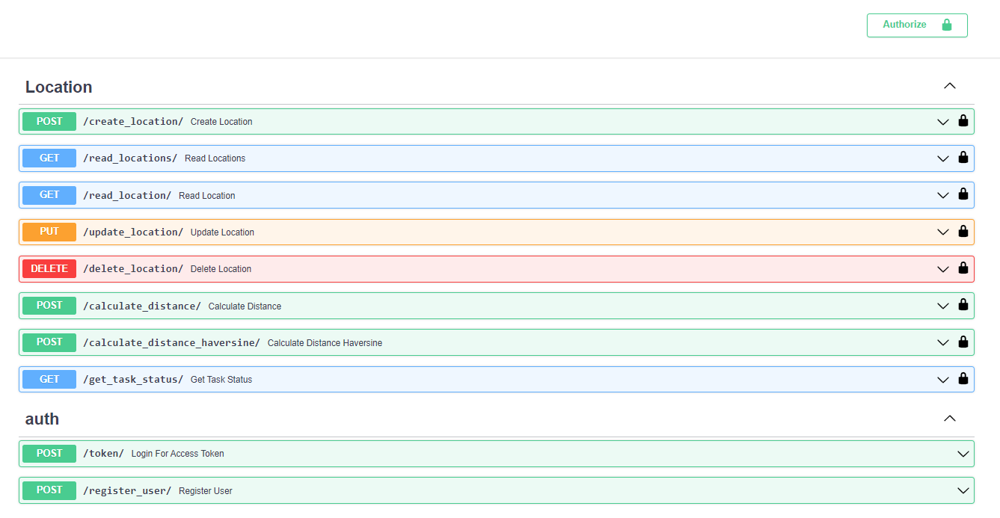

# Technical Test - GeoKapti

In this test, a microservices application was developed to solve a delivery route planning problem.


## Problem Description
The objective of the test is to develop two microservices as a REST API for a delivery route planning company. The required microservices are as follows:

1. Register a location: Accept the name, latitude, and longitude of a location and return a unique ID for that location.

2. Receive a list of location IDs and calculate the total distance of the route.

The second microservice is implemented as a wrapper for a process that communicates via publish/subscribe queues. It subscribes to an inbound queue to receive the list of location IDs and publishes the solution to the problem in the outbound queue.

Python and the FastAPI framework were used for the API development, along with Docker for containerization, and RabbitMQ as the message broker.

## Technologies Used

- Python: The main programming language used to develop the application.
- FastAPI: A web framework used to create the REST API.
- Docker: A platform used to containerize the application and its dependencies.
- RabbitMQ: A message broker used for communication between microservices.

## Project Structure

```
+ app/
  + api/
    - celery.py
    - dependecies.py
    - main.py
    + routers/
      - calculate_distance.py
      - calculate_distance_haversine.py
      - create_location.py
      - delete_location.py
      - get_task_status.py
      - read_location.py
      - read_locations.py
      - register_user.py
      - token.py
      - update_location.py
    + schemas/
      - location.py
      - user.py
  + infrastructure/
    - database.py
  + tests/
- Dockerfile
- docker-compose.yml
- requirements.txt
```

The `app` directory contains the main application code.

- The api directory holds the API-related code.
  - celery.py sets up Celery for asynchronous task processing.
  - dependencies.py defines dependencies used by the API endpoints.
  - main.py is the entry point of the FastAPI application.
  - The routers directory contains individual router modules for each endpoint.
  - The schemas directory defines the data models used for request and response payloads.

- The infrastructure directory includes infrastructure-related code.
  - database.py sets up the database connection using SQLModel.

- The tests directory contains test files for unit testing and integration testing.

- The project root directory contains the following files:
  - Dockerfile specifies the Docker image configuration.
  - docker-compose.yml defines the services and their configuration for Docker Compose.
  - requirements.txt lists the project dependencies.

## Running the Application
Follow these steps to run the application:

1. Make sure you have Docker and Docker Compose installed on your system.

2. Clone this repository to your local machine.

3. Navigate to the project's root directory.

4. Run the following command to build the Docker images and start the services:
```
docker-compose up --build
```
This command will start the application and its dependencies (such as the database, RabbitMQ, and Celery).

5. Once the services are up and running, you can access the API at
- http://localhost:8000
- When the services run correctly, several locations representing cities are automatically added to the database, and a user whose credentials are username='admin' and password='admin' is automatically created.

6. You can see and use openapi autodocumentation tool or any API client to perform the following operations:



7. Click on the Authorize button, and login with the user admin credentials (username=admin, password=admin)

8. Go to the `GET /read_locations/` endpoint then yo can see all locations in the database.

9. Go to `POST /calculate_distance_haversine/` endpoint and pass any locations ids selected of the previus step.

10. With the `GET /get_task_status/` endpoint yo can check of the result of the distance between the locations.

## The API provides the following endpoints:

- `POST /create_location/`: Creates a new location record in the database.

- `GET /read_locations/`: Reads all location records from the database.

- `GET /read_location/`: Reads a location record by ID from the database.

- `PUT /update_location/`: Updates a location record by ID in the database.

- `DELETE /delete_location/`: Deletes a location record by ID from the database.

- `POST /calculate_distance/`: Creates a task to calculate the linear distance between location records and returns the task ID.

- `POST /calculate_distance_haversine/`: Creates a task to calculate the haversine distance between location records and returns the task ID.

- `GET /get_task_status/`: Gets the result of a distance calculation task by task ID.

- `POST /token/`: Generates an access token for authentication.

- `POST /register_user/`: Registers a new user.